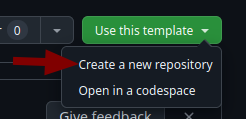

# Codespace template for development of CONTACT Software Functions with Python

This codespace template is used to develop Functions for the CONTACT Software Functions Framework using Python.

## File structure

- `src/`: The code for your Function environment goes here.
- `examples/`: Contains some example Functions, that you can copy and use as a starting point for your own Function.
- `.devcontainer/`: The development container configuration. You probably don't need to touch this.
- `doc/`: Contains the images for the README.md file. Feel free to add your own documentation here.

## How to get started

### Setup your development environment:

- You need a (free) account on GitHub.
- Copy the repository by clicking the "Use this template" button on the top right and select "Create a new repository".

  

- Make sure your new repository is set to private!

  

- In your new repository, create a development container by clicking on the green "Code" button and select "create codespace on main"

  

  This will take a few minutes and you will see a new tab open in your browser with a development container running.
 
### Develop your Function:

- The `src/` folder contains a basic example Function to get you started.
- Make changes to the example Function or add your own
- It is strongly recommended to use git to track your changes and to commit your changes to the repository.
  
  Click on the "Source control" tab on the left side of the development container and you will see the changes you made to the files.

  

  Enter a message describing your changes and click on the "Commit" button.  

  Click on the "Sync changes" button to push your changes to the repository.

  
  

### Deploy your Function:

- In the bottom of your codespace you will see a terminal. Inside the terminal, navigate to the src folder by running the command `cd src`.
- Run `cfc login` to login with your Functions developer credentials (You can retrieve those in the CONTACT Software Portal)
- Create a Function environment by running `cfc env create myenvironment` (pick a name of your choice)
- Deploy your Function by running `cfc env deploy myenvironment`

For a more detailed guide on how to write, deploy and connect your Functions to CIM Database Cloud, please refer to the [Functions-SDK for Python documentation](https://cslab.github.io/functions-sdk-python/) and the [CIM Database Cloud documentation](https://saas-docs.contact-cloud.com/latest-en/admin/admin-contact_cloud/saas_admin/webhooks).

